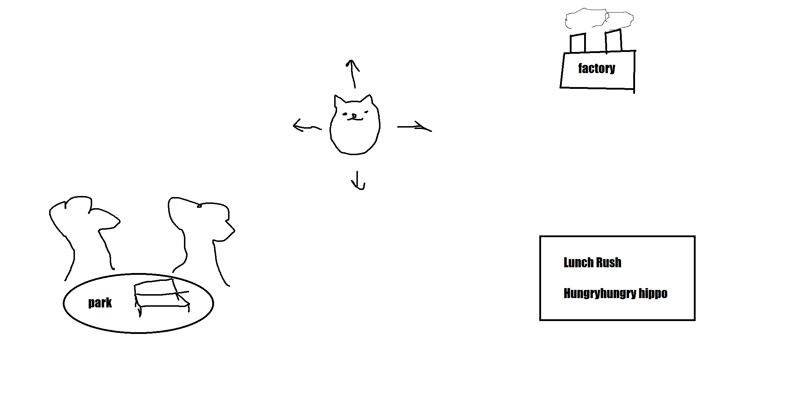

# Brainstorming and Initial Planning

## Overall Gameplay Concepts, Inspirations, and Considerations:
* Simple multiple party games focused around a collection of smaller mini and micro games (30-120 second long games, or as long as needed)
    * Mario Party
    * Wario Ware
    * Nintendo Land

### Menuing and basic features:
* Overworld Hub to act as a menu replacement. Each individual game will have a space/building/etc. that you can enter/walk towards to initiate the game. 
    * Conveyor belt / flappy bird
    * hungry hungry hippos
    * slot game/gacha
    * Personal Space you can decorate with awards or items?
        * Furnite Store
        * House/Apartment
    * Cafe or Bar?
    * Park?

Initially working with 2D setup, but aim to do it in a way that can be transferred into 3D if we wish to move from sprites to low-poly or something.